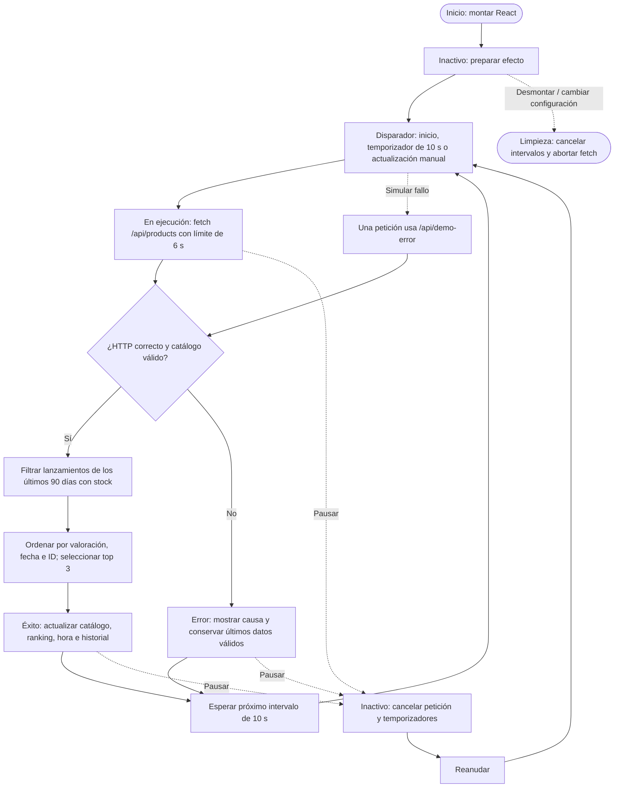

# Workflow: radar de novedades NEXUS

El montaje programa el primer ciclo inmediatamente. Un candado evita solicitudes simultáneas. Pausar conserva el último catálogo; reanudar comienza un ciclo nuevo. La simulación devuelve HTTP 503 una sola vez y el siguiente intervalo usa la ruta normal. Un catálogo válido sin novedades es un éxito con una lista vacía. El plazo de 90 días se calcula con la fecha del sistema, en UTC.
